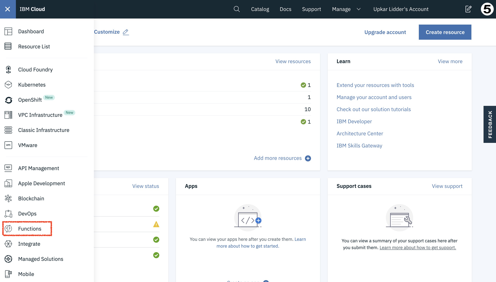
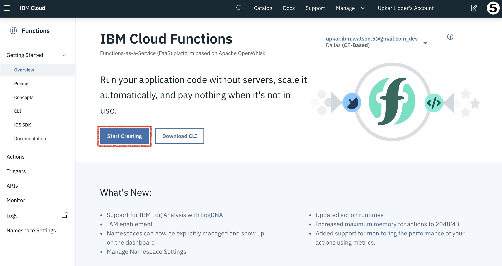
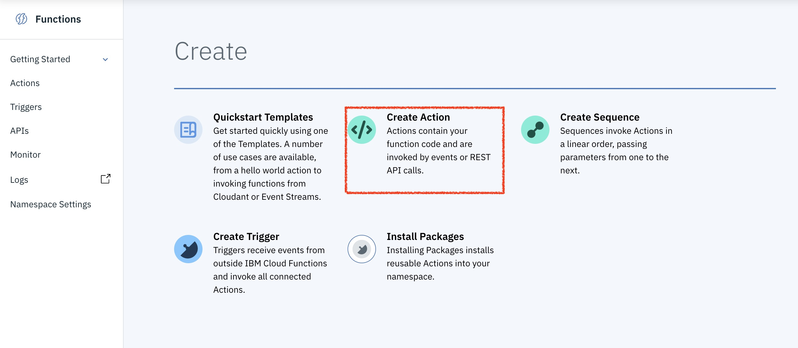
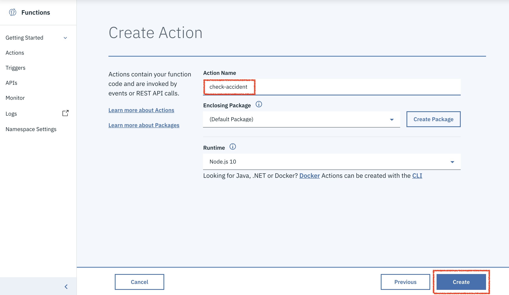
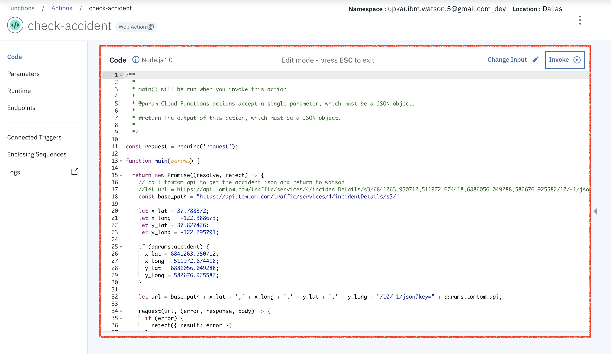
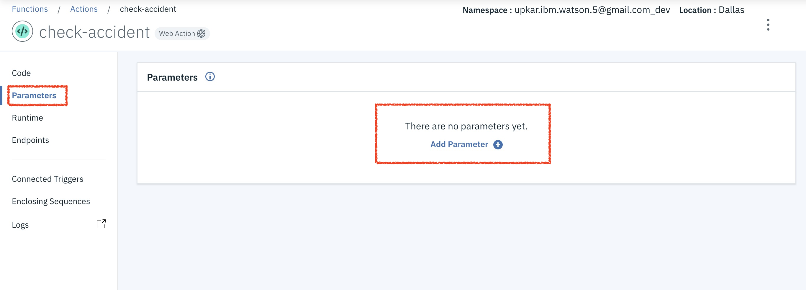
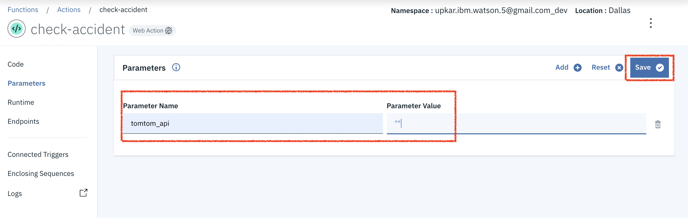
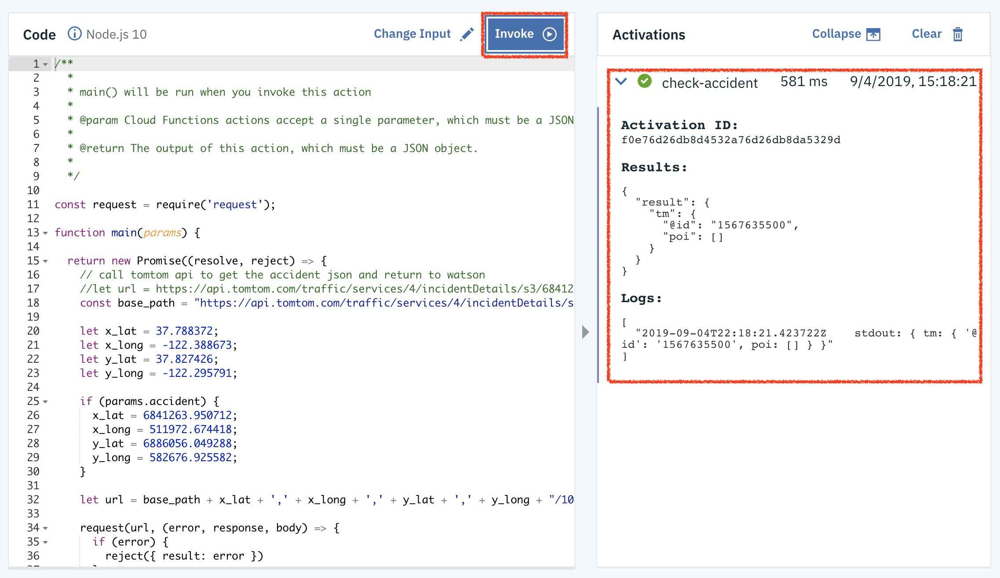

## Serverless action
### Steps
1. Copy `env.sample.json` file into `env.json`.
2. Add your TomTom API key to the `env.json` file.

### If using ibmcloud CLI
3. change into the current directory
```
cd tomtom-ibm/serverless/tomtom-action
```
4. upload the `index.js` as an action to IBM Cloud Functions
```
ibmcloud fn action create check-accident -P env.json index.js
```
5. test the function from command line
```
ibmcloud fn action invoke check-accident -r                 
{
    "result": {
        "tm": {
            "@id": "1567634260",
            "poi": []
        }
    }
}
```

### If using the UI
3. Log into IBM Cloud.
4. Open Cloud Functions from the left panel.


5. Create a new function




6. Copy paste code from index.js into the editor


7. Save the code.
8. Go to Parameters and add your TomTom API key as a param



8. Invoke the function to test

