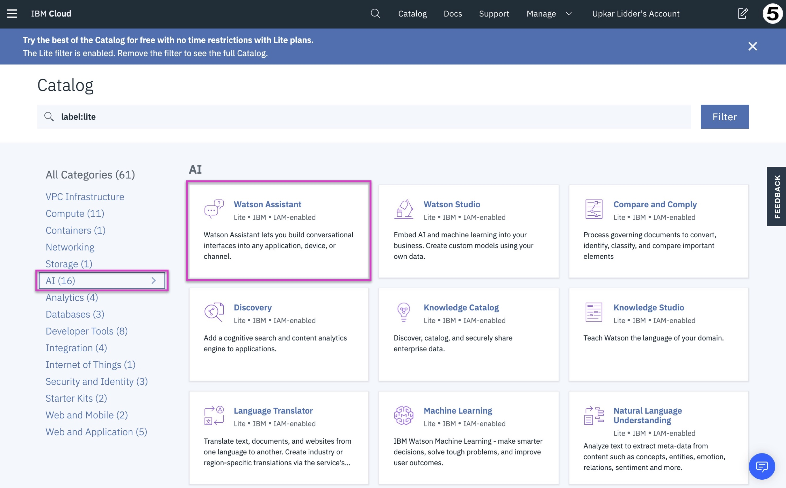
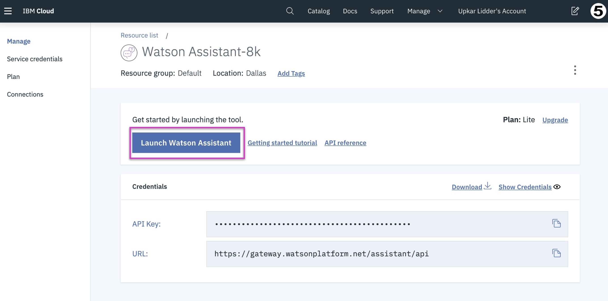
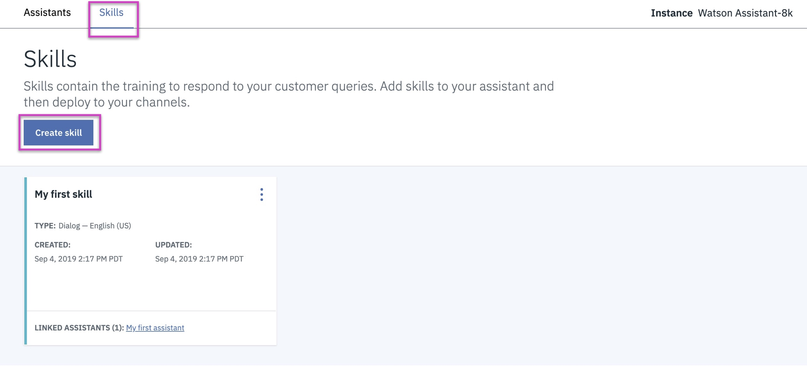
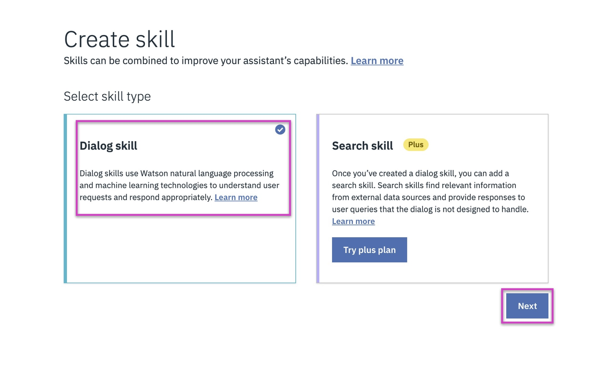
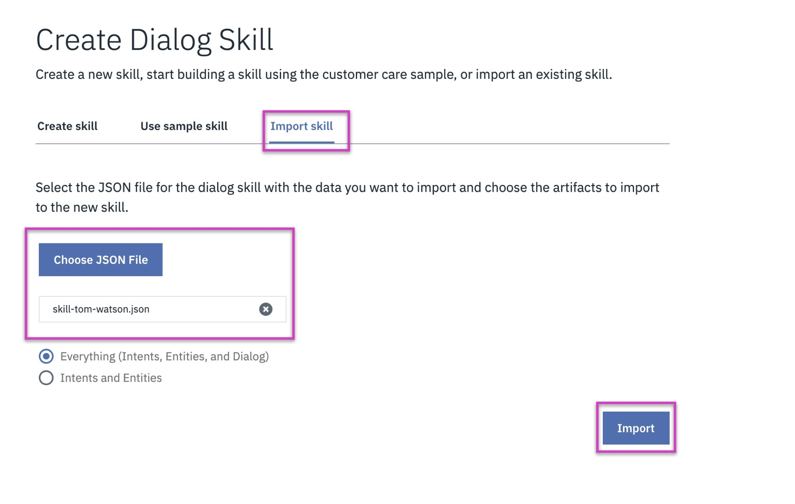
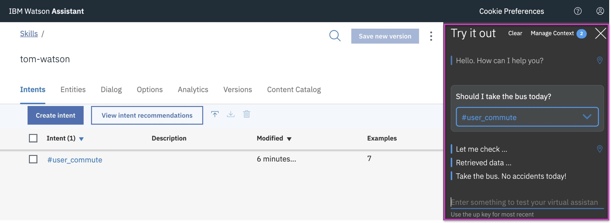

## IBM Watson Assistant

## Steps
1. Download the [json file](./skill-tom-watson.json) from [here](./skill-tom-watson.json).
2. Look for the Watson Assistant service in the IBM Cloud catalog.

3. Create a new Watson Assitant service with the Lite tier.

4. Launch the Watson Assistant.

5. Create a new skill.

6. Create a new Dialog skill.

7. Import the json file that you downloaded in step 1.

8. Try out the assistant in the `Try it out` panel.

